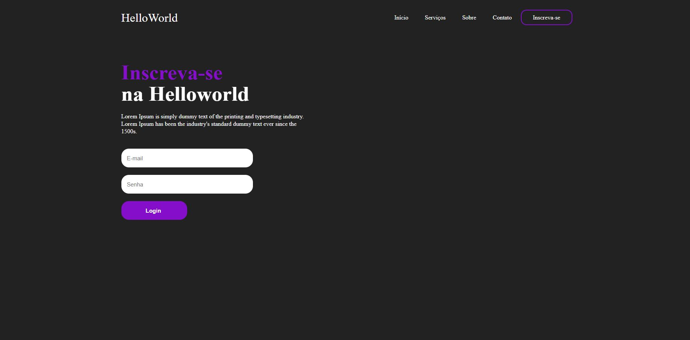
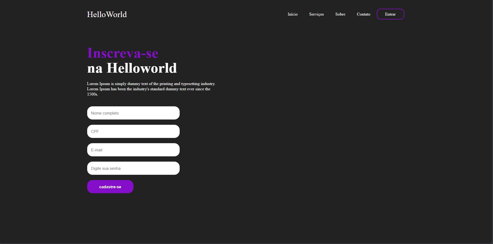

# Página de Login

O desenvolvimento de uma página de login é um dos primeiros passos para criar um sistema seguro e funcional para autenticação de usuários. Utilizando HTML para a estruturação da página e CSS para estilização, foi possível construir um layout intuitivo que permite ao usuário inserir suas credenciais de forma eficiente.

## Plano de projeto

Neste projeto, criei uma interface de login moderna, com um campo para usuário (ou e-mail), um campo para senha, e um botão de login. Além disso, apliquei CSS para melhorar a experiência do usuário, incluindo design responsivo, efeitos visuais e melhoria na acessibilidade.

A implementação dessa página segue boas práticas, garantindo uma interface limpa e organizada, que pode ser facilmente integrada a um sistema de autenticação backend no futuro.

## atualizações 1.1

foram desenvolvidas novas paginas para redirecionamento, uma de cadastro e uma para feedback do cadastro.

✅ foram desenvolvidas novas usabilidades com JavaScript como validação de nome, email e senha!

